## opencv的安装

安装命令：pip install opencv-python -i https://pypi.doubanio.com/simple 

## 加载图片

```python
import cv2
import numpy as np
import matplotlib.pyplot as plt

#加载图像，路径不要有中文
image_bgr = cv2.imread(r'D:\plane.jpg',cv2.IMREAD_COLOR)
#由bgr转化成rgb颜色
image = cv2.cvtColor(image_bgr,cv2.COLOR_BGR2RGB)

plt.imshow(image,cmap='gray')
plt.axis('off')
plt.show()
```

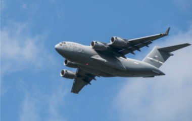

将bgr格式转化为rgb格式，颜色不转化的话会出现下面这种情况

```python
import cv2
import numpy as np
import matplotlib.pyplot as plt

#加载图像，路径不要有中文
image_bgr = cv2.imread(r'D:\plane.jpg',cv2.IMREAD_COLOR)
#由bgr转化成rgb颜色
# image = cv2.cvtColor(image_bgr,cv2.COLOR_BGR2RGB)

plt.imshow(image_bgr,cmap='gray')
plt.axis('off')
plt.show()
```

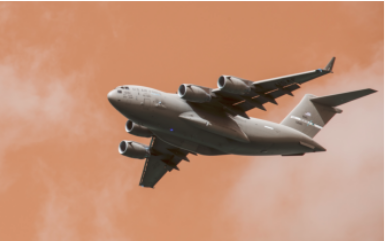

## 保存图片

```python
cv2.imwrite(r'D:\plane1.jpg',image)
```

也可以更改文件的格式，如更改为png

```python
cv2.imwrite(r'D:\plane1.png',image)
```

## 调整图像大小

```python
import cv2
import numpy as np
import matplotlib.pyplot as plt

image = cv2.imread(r'D:\plane.jpg',cv2.IMREAD_GRAYSCALE)

#设置为50 x 50像素
image_50x50 = cv2.resize(image,(50,50))
plt.imshow(image_50x50,cmap='gray')
plt.axis('off')
plt.show()
```

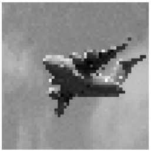

## 裁剪图像

```python
import cv2
import numpy as np
import matplotlib.pyplot as plt

image = cv2.imread(r'D:\plane.jpg',cv2.IMREAD_GRAYSCALE)
# image.shape
# 选择所有行和部分列
image_cropped = image[:,:2000]

plt.imshow(image_cropped,cmap='gray')
plt.axis('off')
plt.show()
```

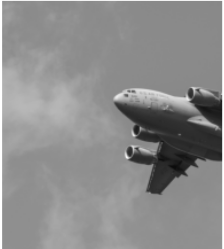

## 图像的平滑处理

```python
import cv2
import numpy as np
import matplotlib.pyplot as plt

image = cv2.imread(r'D:\plane.jpg',cv2.IMREAD_GRAYSCALE)

plt.figure(figsize=(10,10))
plt.subplot(121)
#平滑处理图像
image_blurry1 = cv2.blur(image,(100,100))
plt.imshow(image_blurry1,cmap='gray')
plt.axis('off')


plt.subplot(122)
#平滑处理图像
image_blurry2 = cv2.blur(image,(5,5))
plt.imshow(image_blurry2,cmap='gray')
plt.axis('off')
plt.show()
```

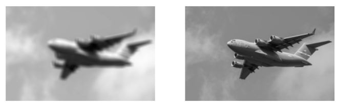

使用filter2D处理图像

```python
import cv2
import numpy as np
import matplotlib.pyplot as plt

#
image = cv2.imread(r'D:\plane.jpg',cv2.IMREAD_GRAYSCALE)

plt.figure(figsize=(10,10))

plt.subplot(121)
#创建核
kernel = np.ones((100,100))/10000.0

#应用核
image_kernel = cv2.filter2D(image,-1,kernel)

# image_kernel.shape
#显示图像
plt.imshow(image_kernel,cmap='gray')

plt.xticks([])
plt.yticks([])


plt.subplot(122)

kernel = np.ones((5,5))/25.0
image_kernel = cv2.filter2D(image,-1,kernel)

plt.imshow(image_kernel,cmap='gray')

plt.xticks([])
plt.yticks([])

plt.show()
```

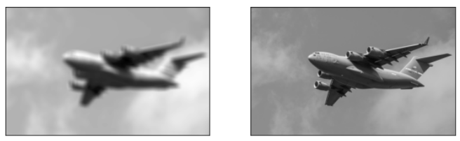

## 图像锐化

```python
import cv2
import numpy as np
from matplotlib import pyplot as plt

image = cv2.imread(r'D:\plane.jpg',cv2.IMREAD_GRAYSCALE)


plt.figure(figsize=(10,4))

plt.subplot(121)
#设置核
kernel = np.array([[0,-1,0],
                   [-1,6,-1],
                   [0,-1,0]
                  ])
image_sharp = cv2.filter2D(image,-1,kernel)
plt.imshow(image_sharp,cmap='gray')
plt.axis('off')


plt.subplot(122)
#创建核
kernel = np.array([
    [0,-1,0],
    [-1,5,-1],
    [0,-1,0]
])

#锐化图像
image_sharp = cv2.filter2D(image,-1,kernel)

plt.imshow(image_sharp,cmap='gray')
plt.axis('off')

plt.show()
```

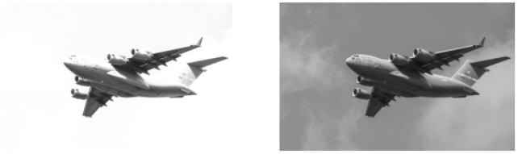

## 提升对比度

```python
import cv2
import numpy as np
import matplotlib.pyplot as plt

image = cv2.imread(r'D:\plane.jpg',cv2.IMREAD_GRAYSCALE)

plt.figure(figsize=(10,4))
plt.subplot(121)
plt.imshow(image,cmap='gray')
plt.axis('off')

plt.subplot(122)
#提升对比度
image_enhanced = cv2.equalizeHist(image)

plt.imshow(image_enhanced,cmap='gray')

plt.axis('off')
plt.show()

```

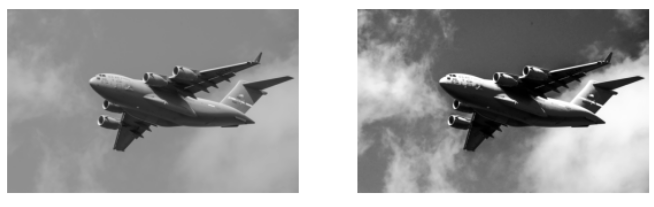

彩色图的处理

```python
import cv2
import numpy as np
import matplotlib.pyplot as plt

image_bgr = cv2.imread(r'D:\plane.jpg')

image = cv2.cvtColor(image_bgr,cv2.COLOR_BGR2RGB)
plt.figure(figsize=(16,8))
plt.subplot(121)
plt.imshow(image,cmap='gray')
plt.axis('off')

plt.subplot(122)
#提升对比度

#转换成YUV格式
image_yuv = cv2.cvtColor(image_bgr,cv2.COLOR_BGR2YUV)

#对图像应用直方图均衡
image_yuv[:,:,0] = cv2.equalizeHist(image_yuv[:,:,0])

#转换成rgb格式
image_rgb = cv2.cvtColor(image_yuv,cv2.COLOR_YUV2RGB)

plt.imshow(image_enhanced)

plt.axis('off')
plt.show()

```

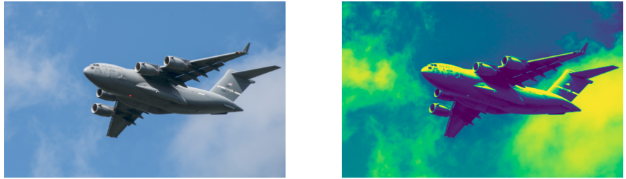

## 颜色分离

```python
import cv2
import numpy as np
import matplotlib.pyplot as plt

image_bgr = cv2.imread(r'D:\plane.jpg')

#将bgr格式的图片转换成HSV格式,hsv代表色调、饱和度和亮度
image_hsv = cv2.cvtColor(image_bgr,cv2.COLOR_BGR2HSV)

#定义HSV中的蓝色分量的区间
lower_blue = np.array([50,100,50])
upper_blue = np.array([130,255,255])

#创建掩模
mask = cv2.inRange(image_hsv,lower_blue,upper_blue)

#应用掩模
image_bgr_masked = cv2.bitwise_and(image_bgr,image_bgr,mask=mask)

#将bgr格式转化为rgb格式
image_rgb = cv2.cvtColor(image_bgr_masked,cv2.COLOR_BGR2RGB)

plt.imshow(image_rgb,cmap='gray')
plt.show()
```

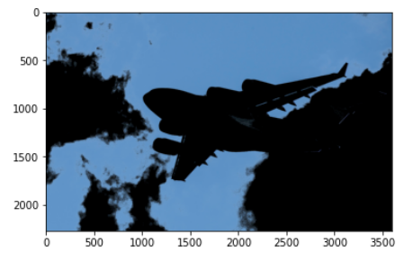

## 图像二值化

```python
import cv2
import numpy as np
import matplotlib.pyplot as plt

#加载图像的灰度图
image_gray = cv2.imread(r'D:\plane.jpg',cv2.IMREAD_GRAYSCALE)

#调整自适应值处理
max_output_value = 255
neighborhood_size = 99
subtract_from_mean = 10
image_binarized = cv2.adaptiveThreshold(image_gray,
                                        max_output_value,
                                        cv2.ADAPTIVE_THRESH_GAUSSIAN_C,
                                        cv2.THRESH_BINARY,
                                        neighborhood_size,
                                        subtract_from_mean
                                       )


plt.imshow(image_binarized,cmap='gray')
plt.show()
```

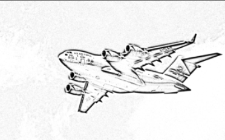

## 移除背景

